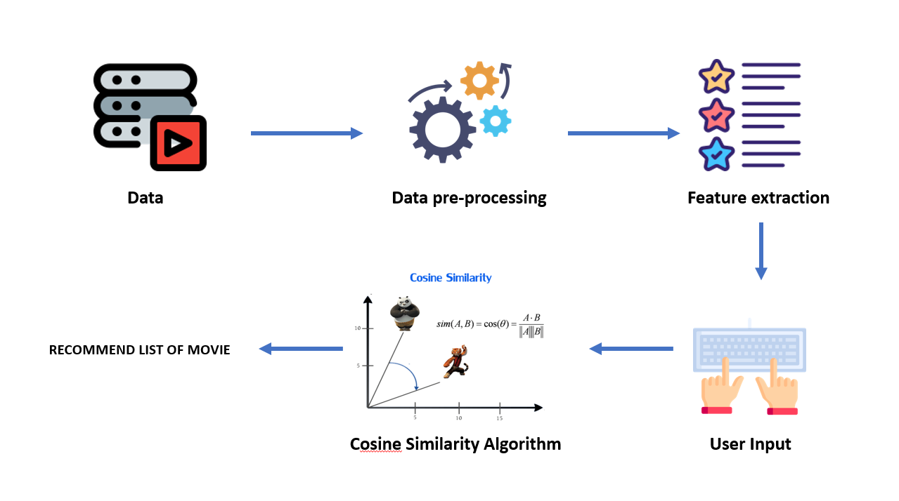
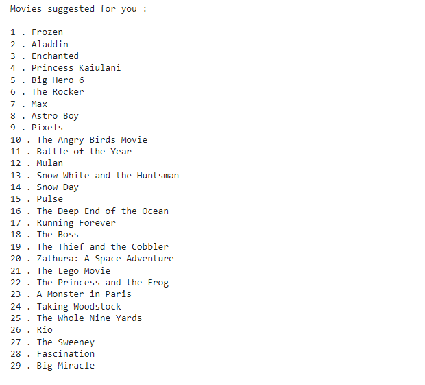

# Movie_Recommendation_System_using_Machine_Learning

## Overview

Here we will create a system in python where a user can give the name of his favourite movie and based on this input the project going to recommend certain movies to him this is what we are trying to accomplish in this particular project.
Most of us are familiar with platforms like Netflix prime video or star etc and in the recent years these platforms have been used extensively by a lot of different people and the main reason for this is these platforms and apps knows what kind of movies and series each user likes so it tries to analyze the users watching pattern and it tries to recommend movies to them and this is one of the main reasons why these platforms have been used a lot
There are three Recommendation system:
-	Content based recommendation system
-	Popularity based recommendation system
-	Collaborative recommendation system

**content-based recommendation system** promotes movies or recommends movies to a user based on the content of the film that they have watched before for example a person is watching multiple superhero movies recommendation system will recommend more of superhero-based movies to the users let's say that if some other person is watching some movies which is related to space and this content-based recommendation system will mainly recommend them space related movies.

**Popularity based recommendation system** this kind of system recommends which movie or series has been very popular so in Netflix, there is column called as top 10 movies in Thailand and the top 10 movies of ultimate such kind of things so it is completely based on popularity and the popularity basically increases if more number of people watches those kind of films.

**Collaborative recommendation system** this type of recommendation system groups people based on their watching pattern let's say that there is a group of people and this certain group of people watching similar kind of movie but these people don’t know each other this is the data collected by these apps mainly focuses on the user's behaviour and the users watching pattern.

We use incorporate content-based recommendation system on a certain amount of popularity such as the title of the movie the cast director.

 

## We use Google Collab to write the code here is the link :
https://colab.research.google.com/drive/1QFKjrEqmV3VdlP2eS5F417135tlyXThz?usp=sharing

 

## Work flow:

***1-Data Collection:***

- We need to have the data of these movies and several details about the movies so we used this Dataset in form of csv file (comma separate value) this data contains of (4803 rows, 24 column).

link https://drive.google.com/file/d/1cckwivv4mgfl20ntgy3n4yapcwqqzqe6/view

***2-Data preparation (pre-processing data):***

- We have to clean this data if there are any missing values.

***3-Feature extraction:***

- This movies dataset is all the data in form of text this is an example of a textual data because this data contains the name of the movies name of the people acted in it Etc.  And we cannot use this data directly so we need to convert these textual data into numerical feature extraction on this movies data set in order to convert them into numerical values convert them into meaningful numerical values. We need transform the textual data to numerical feature vectors it will be easier for us to find the cosine similarity values
Then try to find the similarity score between the movies so let's say that we have about 5000 movies 	
dataset and we will find which movies are similar to each other by giving them a similarity score or	
we can call this as a similarity confidence score

***4-Taking user input:***

- Ask the user to give an input the user will give the name of their favourite movie and based on this data and based on this input we are going to suggest them which movies they can watch.

***5-Choosing the algorithm (cosine similarity algorithm):***

- We used cosine similarity algorithm and this percent similarity algorithm is used in order to find the similarity between the vectors.

***6-List of movies:***

- Now we will get a list of movies and we can now suggest this list of movies to our user.

 

## The Steps we Did:

#### 1-We import all the library we need:

- ***Numpy***: Library is used in order to create Numpy arrays.

- ***Pandas***: Is used to create data frame the data frames are structured table so the data that we have in the form of a comma separated value and it's not easy to analyse and process so we load this data from the csv file to a pandas data frame which is a more structured form.

- ***Difflib***: It’s used to get the close match.

- ***Tfidvectorizer***:We need this tfidvectorizer in order to transform the textual data to numerical feature vectors so once you have this numerical feature vector it will be easier for us to find the cosine similarity values.

- ***Cosine similarity***: It is used to find the singularity score value if the similarity score value.

#### 2-Data collection and processing:
- We have the data in a csv (comma separate value) file called as movies.csv.
-	Loading the data from the csv file to pandas data frame called as movies data .
-	Then we print the first five rows of the data frame using movies_data.head()
-	And we have discussed what are the different columns that we have in our data set so we have various columns such as the genres the keywords tag links etc..  .
-	After that we try to check how many rows and columns we have and we found that totally there are 4803 rows, 24 columns.
-	Next selecting the important features, we don't need all the columns that not much relevant if we want to recommend the movie, we chose column for recommend like ['genres','keywords','tagline','cast','director'].
-	For all these five columns we replacing the missing values with null string.
-	Then we concatenating all the five columns together for each row.

#### 3-Convert textual data to numerical data:
-	Then convert the textual data to numerical values called as features vector using this tfidvectorizer  it will be in the form of numerical values ,the reason we are doing here is doing this particular task is we cannot  find the percent value easily with the text data but if you have a numerical data  you can easily find the cosine similarity value.

#### 4-Use cosine similarity algorithm:
-	Find the similarity scores using cosine similarity we imported .from sklearn.metrics.pairwise import cosine_similarity.
-	Getting the name of the favourite movie of a particular user example FROZEN.
-	Creating a list this list is created with name of the all the movies that is present in our dataset we need all the title to find the close match of the movie name given by the user to compare FROZEN with all the movie names .
-	Use difflib.get_close_matches to get close matches movie name.
-	Try to find the index of the FROZEN movie so we can compare it with all the other movies and can find the similarity score if the similarity score is very low its means that particular movie is not similar to FROZEN and if we suggest that the user may not like, if the similarities score is hight then that movie is similar to FROZEN there is a more chance that user is going to like the movie.
-	We creating this enumerate list we looping over the list and this enumerate will give will give two values first the index and the similarity score (1, 0.047201713274591536)
-	Then we are sorting the values based on the descending order of the similarity score we get movies arranged in the discerning order 
-	Creating a for loop to getting the index value to finding the title of the movie from movies data frame we are looping 30 times because we want to give 30 suggestions for the user 

#### 5-The output will be like this :

- We can use this system with Thai movies.

